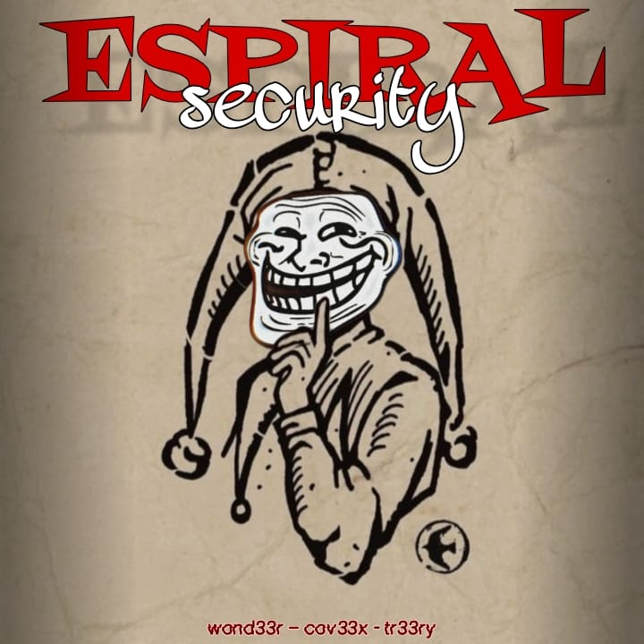
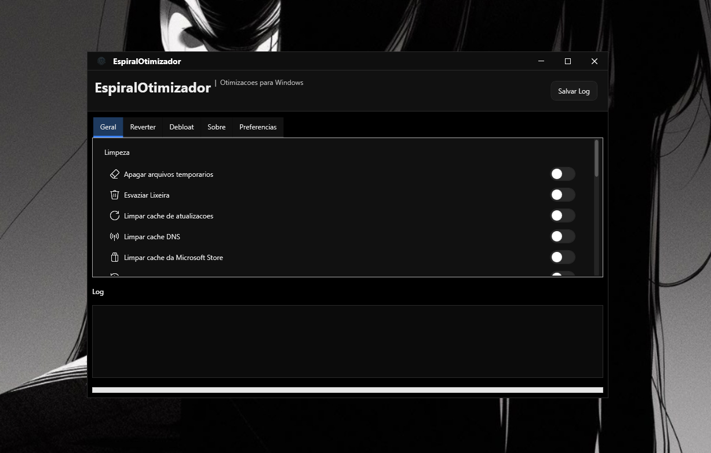

<div align="center">



# EspiralOtimizador

**Um painel de desempenho e limpeza no estilo Windows 11, criado em PowerShell + WPF.**

[](https://learn.microsoft.com/powershell/)
[](#)
[](#)
[](#)
[](#)

</div>

> **Direto. Reversível. Rápido.**
>
> O EspiralOtimizador centraliza ajustes seguros do Windows (limpeza, privacidade, otimização de UX) em uma única interface.  
> Cada alteração é registrada em um painel, e a maioria das ações possui opção de **Reverter com um clique**.

---

## ✅ USO RÁPIDO
1. Abra o PowerShell como Administrador  
2. Execute este comando: ```irm "EM BREVE" | iex```  
3. Divirta-se!

---

## ✨ Destaques

* 🪟 **Visual nativo do Windows 11** — barra de título personalizada, fundo Mica/Acrylic, tema escuro.  
* 🚀 **Otimizações com um clique** — limpeza de temporários, esvaziar Lixeira, limpar cache do Windows Update, limpar DNS, redefinir Microsoft Store, limpar arquivos recentes.  
* 🧩 **Ajustes de desempenho** — desativar Inicialização Rápida, reduzir Telemetria, cortar animações, desativar Game Bar/DVR, Widgets, dicas, apps em segundo plano, Copilot.  
* 🧼 **Painel de desinstalação (Debloat)** — remove apps desnecessários (Candy Crush, Xbox, Skype, Groove, Filmes e TV, Notícias, Clima, Mapas, Visualizador 3D, etc.).  
* 🛟 **Segurança em primeiro lugar** — opção de **Ponto de Restauração** antes das mudanças e ações de **Reversão** (ex.: reativar Inicialização Rápida, telemetria, serviços, menus padrão).  
* 🌐 **Tradução integrada (i18n)** — interface em **Português / Inglês / Espanhol**, com troca em tempo real e preferência salva.  
* 📝 **Log em tempo real + Exportação** — registro detalhado na tela e opção de salvar o log em arquivo.

---

## 📸 Prévia da Interface

<p align="center">
  
</p>

---

## 📦 Requisitos

* **Windows 11** (recomendado) — também compatível com **Windows 10** (com ajustes automáticos)  
* **PowerShell 5.1+** (já vem no Windows) ou **PowerShell 7+**  
* **Privilégios de administrador** para a maioria das otimizações (sem admin, algumas ações serão ignoradas)

---

## 🛠️ Instalação e Execução

> Nenhum instalador necessário. Basta clonar o repositório e executar o script.  
> Se preferir apenas testar, use o parâmetro `-NoElevation` e o botão **Simular**.

```powershell
# 1) Clone este repositório
# 2) Inicie o PowerShell como Administrador (recomendado)
# 3) Execute o script principal

Set-ExecutionPolicy Bypass -Scope Process -Force
./EspiralOtimizador PowerShell.ps1

# Opcional: executar sem elevação automática (útil para testes)
./EspiralOtimizador PowerShell.ps1 -NoElevation
```

> **Nota:** A política de execução é relaxada **apenas para a sessão atual** no exemplo acima.

---

## 🧭 Visão Geral das Funções

### Geral → Limpeza

* Excluir arquivos temporários (usuário e sistema)  
* Esvaziar Lixeira  
* Limpar cache do Windows Update  
* Limpar cache DNS  
* Redefinir cache da Microsoft Store  
* Limpar Arquivos Recentes e Jump Lists  

### Geral → Sistema e Desempenho

* Desativar **Inicialização Rápida** (e **Reativar** na reversão)  
* Reduzir **Telemetria** ao mínimo permitido (e **Reverter**)  
* Desativar **Game Bar/DVR**  
* Reduzir **animações da interface**  
* Ativar **Storage Sense** (limpeza automática)  
* Desativar **sugestões e dicas**  
* Desativar **Widgets**  
* Desativar **aplicativos em segundo plano**  
* Desativar **Copilot** (Win11 23H2+)  

### Desinstalação (Debloat) → Aplicativos e Serviços

* Remover pacotes UWP: **Candy Crush**, **Xbox suite**, **Skype**, **Groove**, **Filmes e TV**, **Notícias**, **Clima**, **Mapas**, **Visualizador 3D**, etc.  
* Serviços pesados (avançado): **Indexação do Windows Search**, **Fax**, **Entrada por Tablet**, **SysMain (Superfetch)**, **Cortana**  

### Reverter

* Reativar **Inicialização Rápida**  
* Reverter configurações de **Telemetria**  
* Restaurar **serviços** e comportamentos padrões da interface (barra de tarefas, menu iniciar, menus de contexto)

---

## 🌍 Idiomas

A interface vem com **Português (pt)**, **Inglês (en)** e **Espanhol (es)**.  
Na primeira execução, você pode escolher o idioma — ele será salvo em `%APPDATA%/EspiralOtimizador/language.json`.

---

## 🔐 Segurança e Transparência

* **Sem instaladores** — código puro em PowerShell. Todo o código é legível e mostra claramente as mudanças em registro/serviços.  
* **Verificação de administrador** com aviso claro quando ações podem falhar sem elevação.  
* **Logs em tempo real** com horário; opção de **salvar o log**.  
* **Ponto de Restauração** opcional para permitir rollback via Restauração do Sistema do Windows.  

> Dica: Leia o código antes de executar. O controle é totalmente seu.

---

## 🧪 Desenvolvimento

* **Stack**: PowerShell + WPF (XAML), interop Win32 (Mica/Acrylic), tarefas assíncronas via runspaces.  
* **Estrutura**: UI (XAML) + funções (limpeza, otimização, reversão, tradução, log) em um único script para fácil auditoria.

### Flags úteis para desenvolvedores

```powershell
# Inicia sem elevação automática (mantém o mesmo console)
./EspiralOtimizador.ps1 -NoElevation
```

---

## 🤝 Contribuição

Pull Requests são bem-vindos.  
Mantenha as alterações **auditáveis** e **reversíveis**.  
Se adicionar um novo ajuste:

* Inclua **mensagens de log**, **traduções (i18n)** e **reversão** quando aplicável.  
* Prefira **políticas/registro** em vez de binários externos.  
* Documente o motivo no PR.  

---

## 🧾 Licença

Este projeto é de código aberto. Consulte o arquivo **LICENSE** para mais detalhes.

---

## 📣 Créditos

Criado por **CovexDev**. Portfólio: [EM BREVE](EM BREVE)

---

## ⚠️ Aviso Legal

Você usa estas otimizações por sua conta e risco.  
Embora a ferramenta priorize configurações seguras e ofereça caminhos de reversão, cada sistema é diferente.  
Crie um ponto de restauração ou backup antes de aplicar mudanças significativas.
